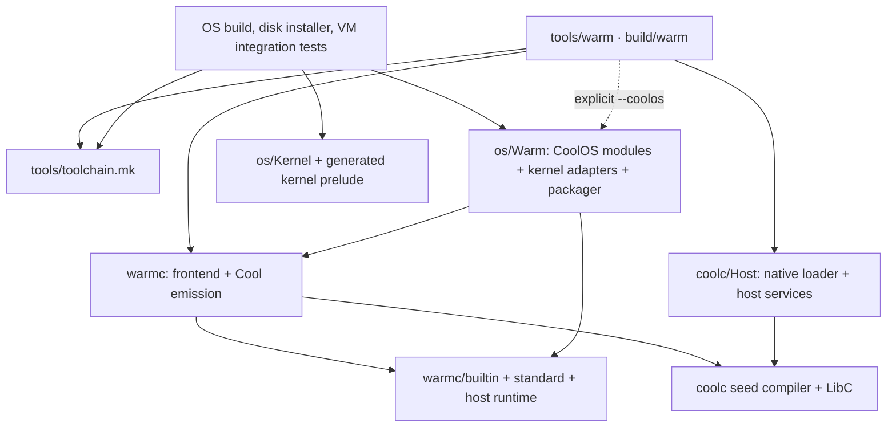

# Warm toolchain boundaries

Warm can build and run host programs without booting CoolOS. The current host is
**macOS on Apple silicon**. Repository separation and a Linux loader are future
work; neither is needed to use the host command today.

## Host command and installation

Install Apple's Command Line Tools (`xcode-select --install`), Python 3.12 or
newer, and GNU coreutils (`gtimeout`). From this checkout:

```sh
make -j -f tools/toolchain.mk warm-host
export PATH="$PWD/build:$PATH"
warm --help
```

`tools/warm` is the canonical command; `build/warm` is a symlink to it. It can be
called from any working directory and lazily builds missing/stale compiler or
formatter artifacts. Input paths, `-I` paths, output paths, and the program's
working directory are relative to the caller. The checkout must remain in place
for the command itself; programs produced by `build` can be copied elsewhere.
No cross compiler, VM, kernel image, or `vendor/` checkout is needed for this
installation. `make warm-host` is the equivalent target in the root Makefile;
plain `make` still builds the OS.

| Command | Behavior |
| --- | --- |
| `warm run file.warm [args]` | Discover imports, check, emit Cool, compile a BIN, then run it with host services. |
| `warm run project/ -- args` | Run a directory project; `--` explicitly separates program arguments. |
| `warm build file.warm -o out` | Produce one executable containing the macOS loader and compiled BIN. Default output is `a.out`. |
| `warm check [file.warm\|directory]` | Discover imports and perform semantic/linearity checks without executing. Default is the current directory. |
| `warm fmt [--check] [files\|directories]` | Recursively format Warm files; default is the current directory. `--check` reports changes with exit status 1. |
| `warm test [files\|directories]` | Run explicit body files or discover `Test.warm` / `*Test.warm` bodies in directories (also legacy `.aum`). Fail on the first failing program; an empty test set is an error. Default is the current directory. |

`run`, `build`, `check`, and `test` accept repeated `-I directory` (or
`--module-path directory`). `run` and `build` accept `--entrypoint=Module:function`.
The inferred entrypoint is the single input body declaring `main`, or the last
explicit body when there is no such declaration. Multiple input mains require an
explicit entrypoint. `test` runs each test independently with its inferred main, adding the test input directory as a module search root.
When invoked in the repository root without inputs, `warm test` runs the host
Warm compiler suite instead of discovering application tests.

Program arguments are passed unchanged, including spaces and flags; use `--` when
an argument resembles a source file, directory, or Warm option. Program exit
status propagates to the caller. `run` uses a temporary BIN path as `argv[0]`;
a built executable uses its invocation path. Stdin/stdout/stderr and the caller's
working directory are preserved. Intermediate build files are temporary.

`build` produces a macOS arm64 Mach-O executable, not a shell launcher: the binary
contains its loader and host runtime, so running it requires neither this
checkout, Python, nor `COOLC_COMPILER_BIN`. Clang is needed to create it. The loader
uses the same BIN relocations and host symbol services as `run`; this is packaging
of the existing native backend, not a new machine-code backend.

## Modules without a manifest

No `warm.toml` is required. A file input starts a project search at its containing
directory; a directory input supplies every Warm source underneath it. Searches
are recursive and use declared module names, so `Utility.Math` may live in
`lib/math.warm`, not necessarily `Utility/Math.warm`.

Resolution order is:

1. Explicit input files, including a body file's sibling `.warmh` interface
   (`.aui` for a legacy `.aum` body).
2. Each input directory or file's containing directory, in input order.
3. Repeated `-I` directories, in command-line order.
4. `warmc/standard/src`, the portable standard library.
5. Only with `--coolos`: `os/Warm/standard/src`, CoolOS extensions.

The first search directory defining a module wins as a whole. A used module
must have at most one interface and one body in that directory; duplicates are
reported as ambiguous. Explicit input definitions take precedence. Interfaces
are passed before bodies, and imports are followed transitively before the
importing module. A module's own interface/body imports are allowed; cycles
between distinct modules and missing dependencies receive discovery errors.
Embedded `Austral.Pervasive` and `Austral.Memory` need no input paths. Search does
not follow directory symlinks or enter hidden directories, `build/`, or `vendor/`.
Unrelated files discovered during a search are not compiled unless supplied by a
directory input or imported by a selected module.

For example:

```text
project/
  app/Main.warm       # module body App; imports Utility.Math
  lib/math.warmh      # module Utility.Math
  lib/math.warm       # module body Utility.Math
```

```sh
warm run project/app/Main.warm -I project/lib
warm build project/ --entrypoint=App:main -o app
cd project
warm check
warm fmt --check
```

## Dependency direction

Arrows mean “uses”. The host makefile can be used without the root Makefile,
`os/`, or `vendor/`; the root Makefile imports it for OS builds.



| Location / target | Owns | Allowed dependencies |
| --- | --- | --- |
| `coolc/`, `coolc-test` | Cool frontend/backend, seed, BIN loader, native host services and compiler tests | Host platform APIs and its own sources; no `os/` sources or generated kernel header. |
| `warmc/`, `warm-test` | Warm frontend, semantics, linearity, emission, builtin/portable libraries, host runtime and tests | `coolc/`; no `os/` build/test prerequisites. Portable `OS.*` APIs use host adapters. |
| `tools/toolchain.mk`, `warm-host`, `host-test` | Independent host build and test entrypoints | `coolc/`, `warmc/`, host tools. |
| `warmc/targets/coolos/` | Explicit `--kernel-module` code-generation runtime | Compiler/runtime code only; never reads `os/` at host bootstrap. |
| `os/Warm/standard/src/OS/CoolOS/` | `OS.CoolOS.*` platform modules | Portable Warm APIs and CoolOS adapters; exposed through `--coolos` or explicit compiler inputs. |
| `os/Warm/*.cool`, `os/Warm/package_kernel.py` | Shell compiler entrypoints and kernel file/net/task/GUI adapters | Warm compiler/runtime, portable shared adapter code, CoolOS kernel services. |
| `os/Warm/modules.py` | OS dependency list and guest disk-path mapping | Portable `warmc/os_modules.py` plus CoolOS module sources. |
| Root Makefile, `warm-integration-test`, `warm-kernel-test` | Kernel, disk packaging, guest compilation and OS integration tests | Host toolchain and `os/`. |

Portable `OS.*` interfaces do not promise every service on every backend. Host
adapters implement file/stream/socket/task services and report unsupported
operations through the existing error APIs. CoolOS extensions remain explicit
platform APIs. The compiler itself does not consume a kernel prelude.

`coolc/Frontend/KernelA.coolh` is the canonical shared compiler header with explicit
`COOLCOM_KERNEL` branches. Host compiler tests include that header directly.
`tools/mkkernela.py` projects its kernel branches into the generated
`os/Kernel/KernelA.coolh`; `build/ShellPrelude.coolh` is separately generated from
kernel sources for the OS shell. These projections belong only to OS build and
integration targets. They are not prerequisites of `warm-host`, `warm-test`, or
`coolc-test`.

The OS still installs portable and CoolOS sources together under
`C:/Warm/Standard/`. `tools/disk-files.sh`, manual generation, and GUI input lists
use the integration mapping, preserving guest paths after the repository move.
The shell compiler package remains `build/warmcool/Kernel.cool` and is installed
as `C:/Warm/Warm.cool`.

## Explicit compiler and interop operations

`warm compile` preserves the low-level `warmc` argument/diagnostic protocol for
compiler conformance tests, foreign exports, and kernel integration. This mode
expects an explicit ordered input list and does not discover imports. Both
`build/warmc` and the native loader remain implementation tools for bootstrapping;
Warm test scripts use `warm` for compilation, native builds, runs, and formatting.

```sh
warm compile Api.warmh,Api.warm Main.warm --entrypoint=Main:main \
  --target-type=hc --output=Main.cool
warm build Main.cool -o Main.BIN
warm run Main.BIN -- argument

# OS-only generation; no host executable entrypoint or host I/O runtime:
warm compile os/Kernel/NetParse.warm --kernel-module=NetParse \
  --target-type=hc --output=NetParse.cool

# Explicit platform API checks:
warm check os/Warm/standard/src --coolos
```

`--kernel-module=NAME` prefixes generated names and uses the small runtime in
`warmc/targets/coolos/ModuleRuntime.cool`. It implies no entrypoint and relies on
kernel allocation/exception services at integration time. Host `run`/`build` do
not silently select this mode. Cool interop `build` with an output ending in
`.BIN` emits a BIN for the shared runner; other output names produce a standalone
executable. A BIN still needs the native loader.

## Verification

```sh
make -j -f tools/toolchain.mk host-test  # compiler/loader/Warm tests, no OS
make -j warm-integration-test          # explicit CoolOS module discovery
make -j test                          # complete repository/OS regression suite
```

Stage 6 language regressions are part of `warm test` and the independent
`warm-test` target (`warmc/test_language.py`). They exercise loop exits, `%`,
string escapes, computed fields, half-open slices, `Standard.Format`, and signed
arithmetic checks through the host CLI. `Standard.Format` and its dependencies
are discovered automatically, just like other portable standard modules.
Real Top/Vim/Tmux compatibility checks live in `os/Warm/test_host_integration.py`;
they use `warm check --coolos` and do not enter the independent host suite.

The host CLI regression suite creates projects outside the repository, checks
recursive module/interface discovery, search paths, ambiguity, entrypoints,
formatting, test failures, argument forwarding, and copies a built executable
elsewhere to run without repository dependencies. Host isolation can also be
checked by copying only `coolc/`, `warmc/`, and `tools/` into a fresh directory and
running the first command there.

## Linux host work (outside this change)

The source-level module rules and Warm frontend are reusable, but the existing
native loader is Darwin-specific. A Linux host needs:

- A loader build that selects platform and architecture explicitly. Replace
  Darwin `MAP_JIT`/`pthread_jit_write_protect_np` with Linux memory protection and
  instruction-cache handling; preserve BIN bounds, relocation, and import checks.
- Linux ABI implementations for native entry/exception assembly, reserved
  registers/TLS, and (for x86_64) the Cool-to-host calling bridge. Darwin's GS/TSD
  discovery cannot be reused on Linux.
- A platform audit of `coolc/Host/native.c` and `warm_{file,net,task}.h`: libc symbol
  registration, paths/capability confinement, processes, threads, clocks,
  sockets/polling, terminal I/O, and error translation.
- A usable compiler bootstrap for each architecture. The checked-in compiler seed
  is arm64; x86_64 host execution currently runs cross-compiled BINs rather than
  bootstrapping the compiler from that seed. Document the seed generation path.
- Portable build selection (`clang` flags, exception sources, `timeout` versus
  `gtimeout`) and a Linux implementation of standalone executable packaging.
- Linux CI that runs `host-test` without `os/` or `vendor/`, including command-line
  arguments, standalone output, traps, memory, file confinement, networking and
  task cancellation. Keep kernel/VM tests in the OS integration suite.

A future repository split can move the host makefile, command, compilers, and
portable libraries together. CoolOS adapters, module lists, disk installation,
and VM tests then consume that toolchain as an external dependency.
